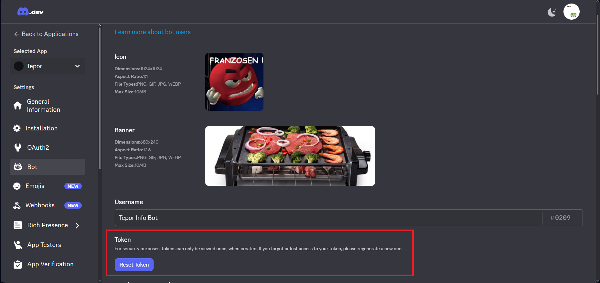

# Discord Bot Setup

The discord bot exists to send Messages to Users/Servers in case of error, warnings, etc. regarding the Management Server.

# Bot Account
First, a bot account needs to be setup at https://discord.com/developers. 
(Plenty tutorials for this exist, the one used during the project was https://discordpy.readthedocs.io/en/stable/discord.html)

Once the bot account ist set up a token needs to be generated. 

# Start the Bot
The token is then saved to an evironment variable with the name: "DISCORD_BOT_TOKEN" (If run with docker, needs to be passed on.).
The bot can then be started. (Once the bot is started, it should show up as online on discord.)
